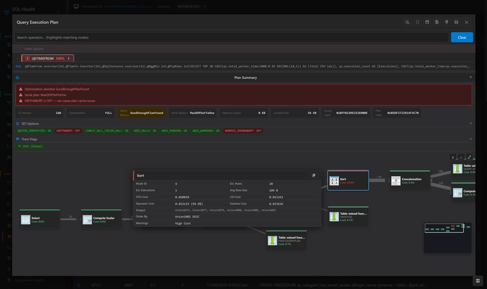

# SQLTriage — Agentless SQL Server Triage That Actually Holds Up at Scale

**Diagnose production issues across 200+ SQL Server instances in seconds — no agents, no installs, no nonsense.**

**Latest**: v0.85.2 (17 Apr 2026) • [Download →](https://github.com/SQLAdrian/SQLTriage/releases)

---

## Why This Exists

Most SQL Server monitoring tools:

* take hours (or days) to deploy
* require agents on every server
* overwhelm you with dashboards instead of answers

At 2AM, none of that helps.

When CPU spikes, blocking explodes, or queries go rogue — you don’t need more data.

You need clarity.

---

## What It Does (In Practice)

SQLTriage gives you immediate visibility into:

* Active sessions across all instances
* Blocking chains and wait stats
* Top resource-consuming queries
* Execution plans you can drill into instantly

No RDP hopping. No scripts. No guessing.

---

---

## Real-World Performance

Tested in production-like environments:

* **200+ SQL Server instances monitored**
* **~800MB RAM usage (service mode, full monitoring enabled)**
* Sub-second dashboard refresh under load
* No agents deployed to monitored servers

Built for DBAs managing large estates without enterprise overhead.

---

## Why It Scales

* Lightweight polling (targeted DMV queries only)
* SQLite WAL cache for fast concurrent reads
* Minimal retention focused on real-time triage
* Efficient batching across multiple instances

This is not a data warehouse.

It is a **live diagnostic tool**.

---

## Typical 2AM Scenario

* CPU spike alert across multiple servers
* Open SQLTriage
* Instantly see blocking chains + top queries
* Drill into execution plan
* Identify root cause in minutes

No scripts. No switching tools. No delay.

---

## How It Compares

| Capability                | SQLTriage             | Script Kits (sp_Blitz, etc.) | SQLWATCH | Enterprise Tools |
| ------------------------- | --------------------- | ---------------------------- | -------- | ---------------- |
| Setup Time                | Seconds (single EXE)  | Minutes (manual)             | Hours    | Hours–Days       |
| Agents Required           | No                    | No                           | Yes      | Usually          |
| Multi-Instance Visibility | Yes (designed for it) | No                           | Yes      | Yes              |
| Real-Time Triage          | Strong focus          | Manual                       | Moderate | Strong           |
| Historical Trending       | Short-term            | None                         | Yes      | Extensive        |
| Alerting                  | Adaptive, low-noise   | None                         | Basic    | Advanced         |
| Execution Plan Analysis   | Interactive           | None                         | Limited  | Advanced         |
| Overhead                  | Very low              | Low                          | Moderate | Varies           |
| Long-Term Warehousing     | No (by design)        | No                           | Yes      | Yes              |

**Positioning:**

* SQLTriage → Fast, agentless triage across SQL Server estates
* Script kits → Manual, reactive troubleshooting
* SQLWATCH → Continuous monitoring with history
* Enterprise tools → Full observability platforms

SQLTriage focuses on the moment that matters most:
**when something breaks and you need answers immediately.**

---

## Capabilities at a Glance

| Area                 | What You Get                                  |
| -------------------- | --------------------------------------------- |
| Real-Time Visibility | Sessions, waits, queries across all instances |
| Diagnosis            | Interactive execution plans + drill-down      |
| Alerting             | Adaptive thresholds, low-noise design         |
| Health Checks        | Built-in vulnerability & risk assessment      |
| Deployment           | Single EXE, no agents, optional service mode  |

---

## What You Can Do With It

### 🔍 See What’s Happening Right Now

* Live sessions across all instances
* Blocking chains and wait stats
* Top CPU, IO, and memory consumers

---

### ⚡ Diagnose Problems Fast

* Interactive execution plans with hover details
* Drill from instance → query → plan in seconds
* Identify root cause quickly

---

### 🚨 Get Alerts Without the Noise

* Adaptive thresholds (IQR-based, not fixed rules)
* Reduced alert fatigue
* Multi-channel notifications when it matters

---

### 🧪 Run Health & Risk Checks

* Built-in vulnerability assessment (CIS-aligned)
* Instance health snapshots
* Useful for audits and incident response

---

### 🖥️ Run It Your Way

* Single EXE — no installation required
* Optional Windows service mode
* Role-based access (Admin / Operator / Viewer)

---

### ☁️ Export and Share

* Export to PDF, CSV, JSON
* Upload securely to Azure Blob Storage
* Share diagnostics without direct server access

---

## Screenshots

Real UI from production usage:

| Live Sessions                                     | Wait Stats                                  | Query Plans                                         | Multi-Instance View                                   |
| ------------------------------------------------- | ------------------------------------------- | --------------------------------------------------- | ----------------------------------------------------- |
|  |  |  |  |

Full gallery → `/docs/screenshots`

---

## Quick Start (60 seconds)

1. Download SQLTriage.exe
2. Run it (no install required)
3. Add your SQL Server instances
4. Start diagnosing immediately

Full guide → `QUICKSTART.md`

---

## Architecture

* Agentless polling model (configurable intervals)
* Local SQLite (WAL) cache for fast reads
* Lightweight instance batching
* Designed for low overhead in large environments

---

## When This May Not Be Enough

SQLTriage is not designed for:

* Long-term performance warehousing
* Cross-platform database monitoring (Oracle, MySQL, etc.)
* Full enterprise observability platforms

For those scenarios, enterprise tools may be more appropriate.

---

## Built With

.NET 8, Blazor, SQLite, Serilog, ApexCharts, Radzen, Azure SDK

Powered by community tooling including sp_Blitz, SQLWATCH, and performance scripts from the SQL Server community.

---

## Contributing

PRs welcome — see `CONTRIBUTING.md`

---

## License

GPL-3.0 — see `LICENSE.txt`